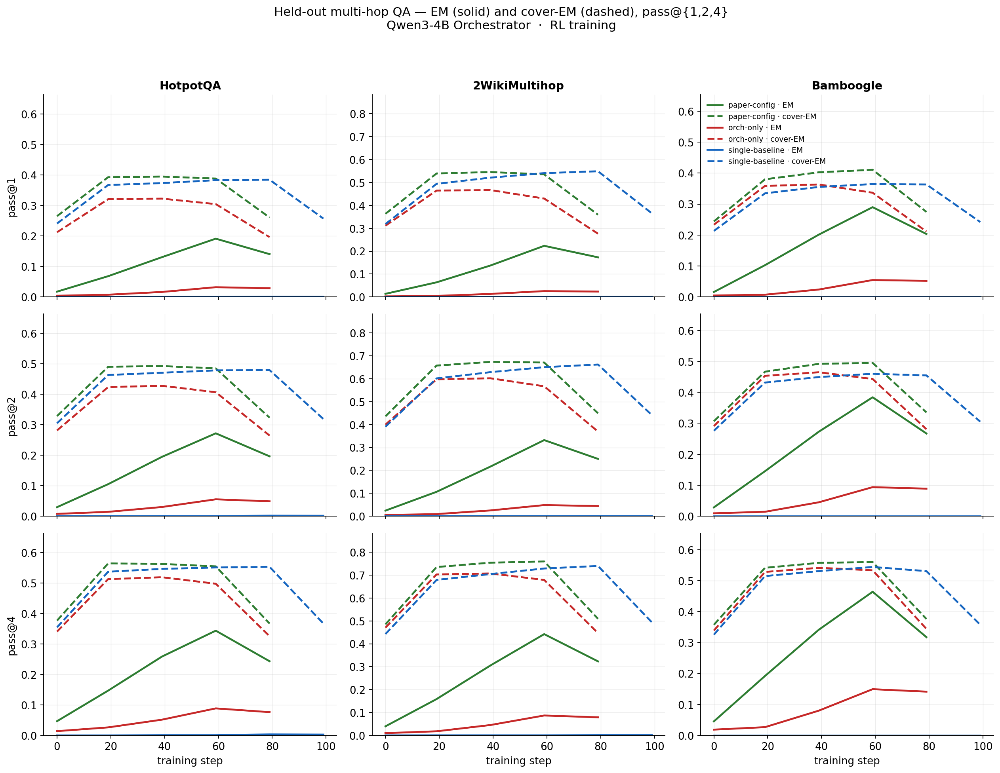

# Reproducing Kimi K2.5's Agent Swarm on Qwen3-4B

Kimi K2.5 (Feb 2026, §3.1) flags two failure modes when training a
delegating Orchestrator with plain outcome reward:

1. **Serial collapse**: policy retreats to single-agent execution
   because subagent feedback is sparse / non-stationary.
2. **Spurious parallelism**: policy fires off arbitrary subagents to
   hack intermediate signals.

Their fix is a decoupled architecture plus
`r_perf + λ₁·r_parallel + λ₂·r_finish`. The paper gives neither
closed-form `r_parallel` / `r_finish` nor the annealing schedule.

I trained three Qwen3-4B runs that differ along a single knob,
`--agent-mode`, which bundles the Orchestrator system prompt *and*
its tool inventory. Everything else (optimizer, dataset, critic,
rollout budget, GRPO config) is identical.

| Run | `--agent-mode` | Direct tools (search / browse / python) | Subagent tools (`create_subagent` / `assign_task`) |
|---|---|:---:|:---:|
| **Single**              | `single-agent` | ✓ | ✗ |
| **Delegate-only**       | `delegate-only` | ✗ | ✓ |
| **PARL**                | `parl`          | ✓ | ✓ |

**PARL** mirrors K2.5 Appendix E.8: the Orchestrator prompt
enumerates Search / Browser / code execution *and* the two swarm
tools. **Delegate-only** is a stricter-than-paper ablation that
strips the direct tools, forcing delegation.

## Subagent dynamics in one view

**(a) Opposite phase transitions; opposite capability flow.** Under
the same RL signal, PARL's `assign_task` rate climbs **0.03 → 1.00**
while Delegate-only's decays **0.80 → 0.10** (Single has no
`assign_task`, flat at 0). Dashed lines mirror this: PARL's
`solver_success_rate` stays **flat at 0.40–0.46** (the frozen
subagent doesn't learn), while Delegate-only, whose surviving
delegations get progressively narrower, improves **0.42 → 0.72** even
as call rate collapses.

This is an action-space finding, not a prompt finding: stripping
the direct-tool fallback collapses RL; the paper-canonical action
space lets RL discover when to delegate. It also reframes K2.5's
serial-collapse warning: the deeper issue isn't reward sparsity but
that a must-delegate action space gives RL no off-ramp.

**(b) Collapsed policy also degenerates.** Delegate-only has no
direct tools to retreat to. Truncation climbs to **23%** and
repetition to **24%**; PARL stays under **5%** on both, Single under
**3%**. The policy slowly gives up on coherent outputs.

**(c) PARL run: plans widen, deepen, specialize.** Evaluated episodes
eventually compose **~12 `assign_task` × ~11 `create_subagent`**,
with critical path growing in step. Distinct subagent names per
episode grow **0 → ~5**, a scalar proxy for K2.5 Figure 6's
specialization word-cloud our logs don't capture directly. The gap
between 11 instantiations and 5 names means the Orchestrator
**re-uses** specialists across subtasks rather than spawning fresh.

The delegation dynamics reproduce cleanly, which is the point.
The **target task** (WideSearch item-F1) does not improve in any
run within the 80-rollout window, and `is_success ≡ 0` throughout.
Two closable gaps explain it:

- `rollout_max_critical_steps = 48` vs K2.5 E.8's **100+100** budget;
- `reward.py` ships `ANNEAL_FRAC = 100.0`, so `λ₁`/`λ₂` **never
  anneal** under the planned rollout count. Constant
  `r_parallel + r_finish` pressure is what panel (c) really portrays:
  the policy hacks spawn count (`n_assign` → ~12, `r_parallel` →
  0.70) under a frozen schedule. Both are one-line changes and the
  obvious next run.

## Held-out multi-hop QA

Columns: HotpotQA, 2WikiMultihop, Bamboogle. Rows: pass@1 / @2 / @4.
EM solid, cover-EM dashed.

- **PARL leads on strict EM** across all three benchmarks and all
  pass levels. Ordering doesn't invert with K, so this isn't a pass@4
  artifact.
- **cover-EM narrows the gap.** All three runs cluster in similar
  cover-EM bands. Subagents already "know" the answer; what the
  Orchestrator learns is to assemble and format precisely enough for strict EM.
- **Delegate-only trails Single on HotpotQA / 2Wiki cover-EM**,
  another symptom of the collapse in panel (b).

---

**Runs**: Qwen3-4B Orchestrator + frozen Qwen3-4B subagent, GRPO, ~80 updates.

**Reference**: Kimi Team, *Kimi K2.5: Visual Agentic Intelligence*,
arXiv:2602.02276, §3.1 and Appendix E.8.
