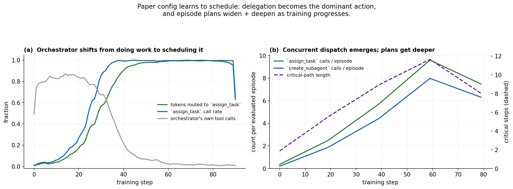

# Two opposite phase transitions under the same RL signal

*Reproducing Kimi K2.5's Agent Swarm on Qwen3-4B — a short note.*

Kimi K2.5 (Feb 2026, §3.1) warns about two failure modes when training a
delegating Orchestrator with plain outcome reward:

1. **Serial collapse** — the policy retreats to single-agent execution
   because independent-subagent feedback is sparse/non-stationary.
2. **Spurious parallelism** — the policy fires off arbitrarily many
   subagents to hack intermediate signals.

The paper proposes a decoupled architecture and a `r_perf + λ₁·r_parallel
+ λ₂·r_finish` reward to sidestep both. The paper does **not** give
closed-form formulas for `r_parallel` / `r_finish`, nor the annealing
schedule.

I trained three Qwen3-4B RL runs that differ **only** in the orchestrator
prompt + which tools are exposed. Everything else — optimizer, dataset,
critic, rollout budget, GRPO config — is identical:

| Run | Orchestrator prompt | Tools available |
|---|---|---|
| `single-baseline` | single-agent prompt | search / browse / python |
| `orch-only`       | **default** prompt  | search / browse / python / `create_subagent` / `assign_task` |
| `paper-config`    | K2.5 orchestrator prompt | search / browse / python / `create_subagent` / `assign_task` |

## 1 · Same RL signal, opposite phase transitions

Same tool set. Different system prompt. Opposite phase transitions.

- **paper-config** (green): `assign_task` rate climbs **0.03 → 1.00**.
- **orch-only** (red): `assign_task` rate decays **0.80 → 0.10**. Starts
  willing to delegate (because the tools are there), but RL actively
  *unlearns* delegation under the default prompt.

In the paper config the three delegation statistics move in lockstep:
`assign_rate` and `delegate_ratio` go to 1.0, `direct_tool_rate` drops
from 0.79 to 0.02. The Orchestrator essentially stops calling tools
itself and becomes a pure dispatcher.

The serial-collapse run doesn't just give up delegation — it also
decoheres. Truncation rate climbs from ~0 to **23%**, repetition from
~0 to **24%**. The paper run stays under 5% on both. So the failure
mode isn't "harmless single-agent fallback"; it's a policy slowly
giving up on producing coherent outputs.

This makes K2.5's theoretical serial-collapse an observable, <100-step
phase transition — driven by prompt, not by the policy's tool inventory.

## 2 · The Orchestrator learns to schedule

Zooming into the paper-config run: RL progressively shifts the
Orchestrator from *doing* work to *scheduling* it. Token budget routed
to `assign_task` grows from 2% to 99%; the Orchestrator's own direct
tool calls collapse to 2%.

At the same time, each episode's plan widens *and* deepens:
`assign_task` and `create_subagent` calls per evaluated episode grow
from roughly zero to 8-12, and the critical-path length grows
proportionally. The Orchestrator is not just calling `assign_task` more
often — it is composing bigger, deeper plans to spread across frozen
subagents.

This is the scheduler behavior K2.5's Figure 4 describes, reproduced
cleanly on a 4B orchestrator with the paper's prompt and a critical-step
budget.

## 3 · Multi-agent > single-agent on held-out evals

Held-out multi-hop QA (HotpotQA, 2WikiMultihop, Bamboogle) evaluated
over training, with **EM (solid) and cover-EM (dashed) at pass@{1,2,4}**.

- **paper-config (green) is clearly ahead on strict EM** across all
  three benchmarks and all three pass levels. The swarm-trained
  Orchestrator generalizes the delegation strategy to out-of-distribution
  QA.
- **Ordering is stable as pass@K widens.** At pass@4 the paper-config
  EM reaches 0.30+ on all three benchmarks; orch-only and
  single-baseline stay near 0.10.
- **cover-EM narrows the gap.** Reported alongside for context; the
  three runs land in similar cover-EM bands across the benchmarks.

The architectural choice (delegate or don't) plus the prompt that
stabilizes delegation dominates the RL signal on strict EM.

## What's next

The delegation dynamics reproduce cleanly. The open items are on the
reward-shaping side:

- **Anneal λ₁/λ₂.** The current `reward.py:ANNEAL_FRAC = 100.0` means
  auxiliary terms never decay. Replacing with a proper schedule is the
  smallest-delta next experiment.
- **Critical-step budget 48 → 100+100.** Matches the paper's Appendix
  E.8 for WideSearch; required before a fair final-benchmark number.
- **Curriculum on subagent size.** Swap a smaller frozen subagent into
  `configs/sglang_4B.yaml` and re-run to try the paper's curriculum.

---

**Runs**: `pa9lipn3` (single), `tqzr8z9x` (orch-only), `gbamfgd3`
(paper-config). All ran on 1× H200 × 8, Qwen3-4B Orchestrator +
Qwen3-4B frozen Subagent, GRPO, ~80 updates. Reproduction launchers:
[`scripts/run-qwen3-4B-{single,orchestrator_only,parl}.sh`](scripts/).

**Reference:** Kimi Team, *Kimi K2.5: Visual Agentic Intelligence*,
arXiv:2602.02276, §3.1 and Appendix E.8.
