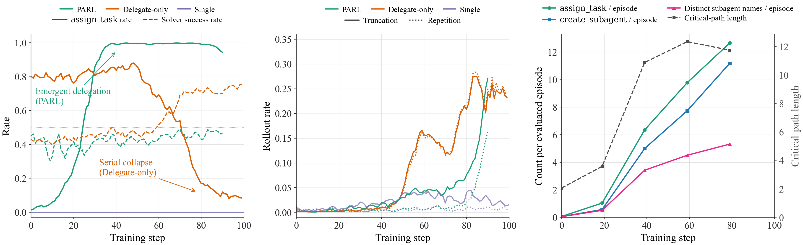

# OpenPARL

**Research reproduction of Kimi K2.5 Agent Swarm (PARL) on WideSearch.**
arXiv:2602.02276, *"Kimi K2.5: Visual Agentic Intelligence"* (Kimi Team, 2026).

> OpenPARL is a personal learning independent reproduction, **not** an official Kimi /
> Moonshot product. No endorsement by the paper authors is implied.

## Features

A minimal, from-scratch reproduction of the K2.5 PARL recipe:

- **Qwen3-4B Orchestrator** trained with RL (GRPO + TIS, icepop) +
  **Qwen3-4B Subagent**, frozen, serving `assign_task` on a separate
  SGLang engine.
- Per-token credit assignment: RL advantages only touch Orchestrator
  tokens; Subagent tokens are environmental observations.

Three launcher configurations along a single action-space axis:

| Launcher | `--agent-mode` | Tools available | Blog label |
|---|---|---|---|
| `scripts/run-qwen3-4B-parl.sh`           | `parl`           | search / browse / python **+** `create_subagent` / `assign_task` | **PARL** |
| `scripts/run-qwen3-4B-delegate-only.sh`  | `delegate-only`  | `create_subagent` / `assign_task` **only** (no direct-tool fallback) | **Delegate-only** |
| `scripts/run-qwen3-4B-single.sh`         | `single-agent` | search / browse / python **only** (no delegation) | **Single** |

**PARL** follows K2.5 Appendix E.8 literally. **Delegate-only** is a
stricter-than-paper ablation that strips the direct-tool fallback to
probe what happens when the Orchestrator *must* delegate.



See [**BLOG.md**](BLOG.md) for the full write-up.

## Install

OpenPARL runs inside the official miles container. Nothing is installed
on your host.

```bash
# 1. Clone on the host.
git clone https://github.com/GuanxingLu/OpenPARL.git
cd OpenPARL

# 2. Enter the miles container with OpenPARL mounted.
docker run --gpus all -it --shm-size=32g --privileged \
    --ulimit memlock=-1 --ulimit stack=67108864 --ulimit nofile=65536:65536 \
    -v "$(pwd)":/workspace/OpenPARL \
    radixark/miles:latest /bin/bash

# 3. Inside the container:
cd /workspace/OpenPARL && ./install.sh
```

## Reproduce

```bash
# 1. One-off: build the *.miles.jsonl train/eval files.
python -m openparl.widesearch.prepare_data

# 2. Launch the local RAG server (port 8000 by default).
bash scripts/launch_rag_server.sh

# 3. Pick a config.
bash scripts/run-qwen3-4B-parl.sh           # PARL          (--agent-mode parl)
bash scripts/run-qwen3-4B-delegate-only.sh  # Delegate-only (--agent-mode delegate-only)
bash scripts/run-qwen3-4B-single.sh         # Single        (single-agent)
```

## RL Infra

The PARL training recipe needs ~191 LOC of hooks in miles. They ship as
4 paper-legible commits on
[`GuanxingLu/miles@openparl-v1`](https://github.com/GuanxingLu/miles/tree/openparl-v1)
(tag `v0.1-openparl`):

| Commit | What it enables |
|---|---|
| `feat(sample): per-token advantages for turn-level credit assignment` | Routes advantage only to Orchestrator tokens; Subagent tokens are zero-grad |
| `feat(args): --disable-entropy-computation flag` | Lets 4B + 4B frozen subagent fit one H200 node (skips the fp32 entropy allocation peak) |
| `feat(metrics): multi-agent pass@k + tool-call-parse-failure + paper-style @k` | Correct `pass_reward` accounting when rollout emits non-primary trajectories; false-tool-call rate; avg@N / max@N aggregators |
| `feat(rollout): allow group_rm during eval for multi-agent rollouts` | Unblocks eval when the reward function sees the whole (Orchestrator + Subagent) group |

## License

Apache-2.0. See [`LICENSE`](LICENSE) and [`NOTICE`](NOTICE).
