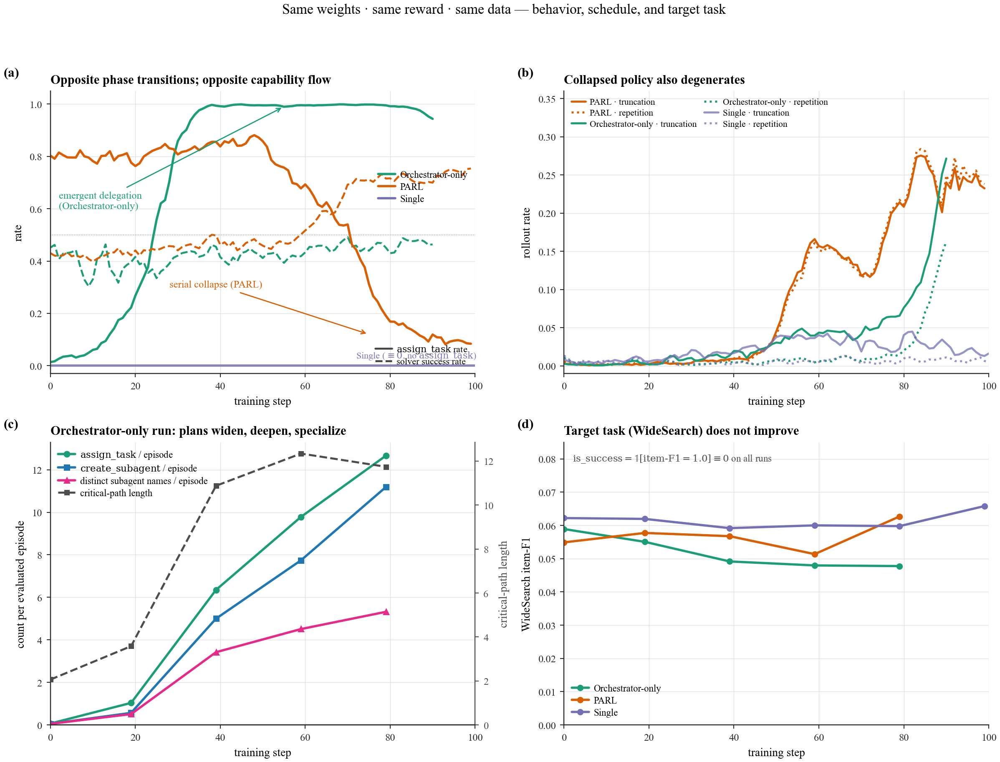

# OpenPARL

**Research reproduction of Kimi K2.5 Agent Swarm (PARL) on WideSearch.**
arXiv:2602.02276 — *"Kimi K2.5: Visual Agentic Intelligence"* (Kimi Team, 2026).

> OpenPARL is an independent reproduction, **not** an official Kimi /
> Moonshot product. No endorsement by the paper authors is implied.

## What's here

A minimal, from-scratch reproduction of the K2.5 PARL recipe:

- **Qwen3-4B Orchestrator** trained with RL (GRPO + TIS, icepop).
- **Qwen3-4B Subagent**, frozen, serving `assign_task` calls on a
  separate SGLang engine (same family as the Orchestrator; swap in a
  different checkpoint in `configs/sglang_4B.yaml` for an asymmetric
  ablation).
- Per-token credit assignment: RL advantages only touch Orchestrator
  tokens; Subagent tokens are environmental observations.
- `create_subagent` / `assign_task` tools wired into the rollout driver
  with genuine concurrent dispatch.
- Critical-step budget as the episode bound, not total tool calls.

Three launcher configurations that isolate the role of the K2.5
orchestrator prompt:

| Launcher | Prompt | Tools available | Blog label |
|---|---|---|---|
| `scripts/run-qwen3-4B-orchestrator_only.sh` | K2.5 orchestrator prompt (`swarm-paper`) | search / browse / python + `create_subagent` / `assign_task` | **paper-config** |
| `scripts/run-qwen3-4B-parl.sh`              | OpenPARL default (`swarm-strict`)         | same as above | **orch-only** |
| `scripts/run-qwen3-4B-single.sh`            | Single-agent prompt                       | search / browse / python only | **single-baseline** |

(Launcher names are historical; the blog's labels are the useful
mental model.)

## Headline result

See [**BLOG.md**](BLOG.md) for the full write-up. One-sentence version:
**the same RL signal pushes the Orchestrator into opposite phase
transitions depending only on its system prompt** — the paper prompt
drives `assign_task` rate from 0.03 → 1.00 in <60 training steps, while
the default prompt un-learns delegation (0.80 → 0.10) and decoheres the
policy (truncation climbs to ~23%, repetition to ~24%).



## Install

OpenPARL runs inside the official miles container. Nothing is installed
on your host.

```bash
# 1. Clone on the host.
git clone https://github.com/GuanxingLu/OpenPARL.git
cd OpenPARL

# 2. Enter the miles container with OpenPARL mounted.
docker run --gpus all -it --shm-size=32g --privileged \
    --ulimit memlock=-1 --ulimit stack=67108864 --ulimit nofile=65536:65536 \
    -v "$(pwd)":/workspace/OpenPARL \
    radixark/miles:latest /bin/bash

# 3. Inside the container:
cd /workspace/OpenPARL && ./install.sh
```

`install.sh` overlays 4 PARL framework hook commits on top of the
image's miles (via `pip install --no-deps ...@v0.1-openparl`, leaving
sglang / megatron / ray untouched) and installs OpenPARL in editable
mode.

For the exact pinned image tag and container layout, see
[`docs/reproducibility.md`](docs/reproducibility.md).

## Reproduce

```bash
# 1. One-off: build the *.miles.jsonl train/eval files.
python -m openparl.widesearch.prepare_data

# 2. Launch the local RAG server (port 8000 by default).
bash scripts/launch_rag_server.sh

# 3. Pick a config.
bash scripts/run-qwen3-4B-orchestrator_only.sh   # paper-config
bash scripts/run-qwen3-4B-parl.sh                # orch-only
bash scripts/run-qwen3-4B-single.sh              # single-baseline
```

Hardware / env vars / expected wall-clock + the exact run IDs
reproduced in [BLOG.md](BLOG.md) are documented in
[`docs/reproducibility.md`](docs/reproducibility.md).

## Results at a glance

80-step snapshot of the three training runs (self-hosted wandb, see
`docs/reproducibility.md` for the run IDs):

| Metric (first → last window) | single-baseline | orch-only | paper-config |
|---|---|---|---|
| `multi_turn/assign_rate`            | 0.00 → 0.00 | 0.80 → **0.10** ↘ | 0.03 → **1.00** ↗ |
| `multi_turn/delegate_ratio/mean`    | 0.00        | —                 | 0.02 → **0.99** ↗ |
| `multi_turn/direct_tool_rate`       | 0.78 → 1.00 | —                 | 0.79 → **0.02** ↘ |
| `rollout/truncated_ratio`           | 0.6% → 2%   | 0.2% → **23%** ↘  | 0.2% → 5%         |
| `rollout/repetition_frac`           | 0.6% → 0.7% | 0.3% → **24%** ↘  | 0.3% → 1%         |
| `eval/hotpotqa/em/pass@1`           | ≈ 0         | 0.00 → 0.02       | 0.00 → **0.11**   |
| `eval/2wiki/em/pass@1`              | ≈ 0         | 0.00 → 0.02       | 0.00 → **0.13**   |
| `eval/bamboogle/em/pass@1`          | ≈ 0         | 0.00 → 0.03       | 0.00 → **0.18**   |

Full multi-panel figures live in [BLOG.md](BLOG.md) and
`docs/assets/`.

## Repository map

```
src/openparl/             agent code (prompts, generate, rollout_log, run, tool)
  widesearch/             widesearch-specific (reward, prompts, tools, prepare_data)
third_party/rag_server/   RAG server vendored from RLinf
configs/                  sglang configs (sglang_4B.yaml)
scripts/                  launchers (.sh) + RAG server launcher
tests/                    CPU-only unit tests (reward + reward_utils)
docs/                     architecture / reward / reproducibility / assets/
BLOG.md                   blog post (phase-transition write-up)
install.sh                container-local install
```

## Framework hooks

The PARL training recipe needs ~191 LOC of hooks in miles. They ship as
4 paper-legible commits on
[`GuanxingLu/miles@openparl-v1`](https://github.com/GuanxingLu/miles/tree/openparl-v1)
(tag `v0.1-openparl`):

| Commit | What it enables |
|---|---|
| `feat(sample): per-token advantages for turn-level credit assignment` | Routes advantage only to Orchestrator tokens; Subagent tokens are zero-grad |
| `feat(args): --disable-entropy-computation flag` | Lets 4B + 4B frozen subagent fit one H200 node (skips the fp32 entropy allocation peak) |
| `feat(metrics): multi-agent pass@k + tool-call-parse-failure + paper-style @k` | Correct `pass_reward` accounting when rollout emits non-primary trajectories; false-tool-call rate; avg@N / max@N aggregators |
| `feat(rollout): allow group_rm during eval for multi-agent rollouts` | Unblocks eval when the reward function sees the whole (Orchestrator + Subagent) group |

## What's next

Things I'm planning to run, in rough order of payoff:

1. **λ₁/λ₂ anneal schedule.** `reward.py:ANNEAL_FRAC = 100.0` currently
   means "never anneal"; replace with a proper anneal so auxiliary
   terms decay on schedule.
2. **Critical-step budget 48 → 100+100.** Align with paper Appendix
   E.8 for WideSearch before running the final headline numbers.
3. **Curriculum on Subagent size.** Paper trains Orchestrator against
   smaller Subagents first, then scales up. Swap a smaller HF
   checkpoint into the `subagent` server group in
   `configs/sglang_4B.yaml` to try the asymmetric variant.

## License

Apache-2.0. See [`LICENSE`](LICENSE) and [`NOTICE`](NOTICE).

## Cite

If you build on OpenPARL, please cite the Kimi K2.5 paper and this
repository. A BibTeX block for both will live at the bottom of
[BLOG.md](BLOG.md) once the arXiv ID stabilizes.
